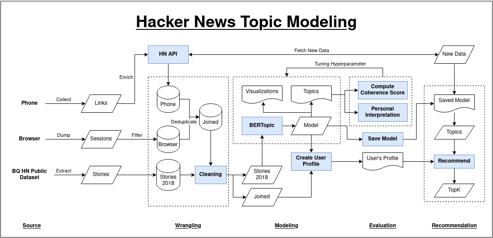
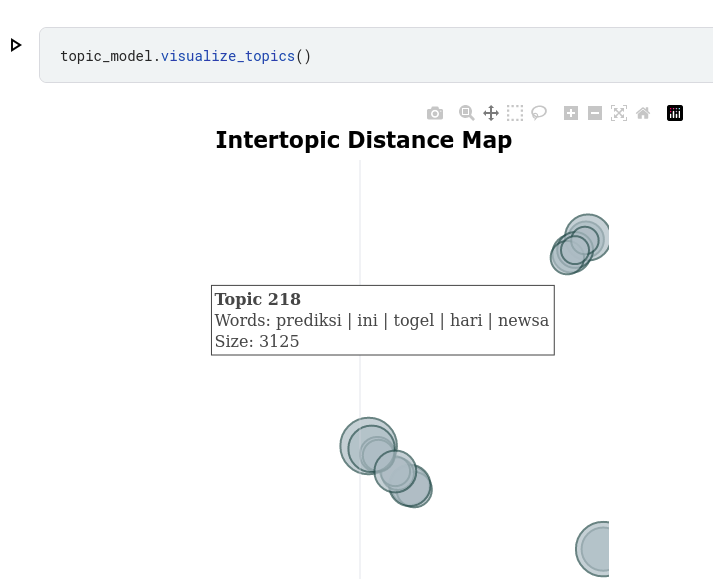
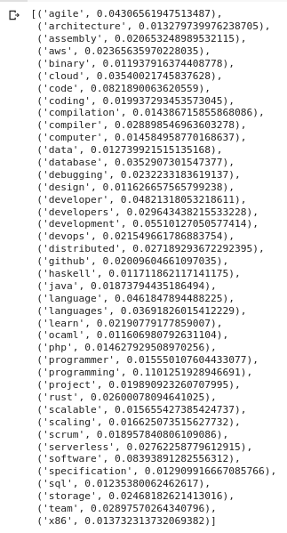

# Hacker News Topic Modeling

Modeling [Hacker News][Hacker News] topics using [BERTopic][BERTopic] and making a content-based recommendations out of it (using my personal session data)

## Why

Hacker News is a social news website focusing on computer science and entrepreneurship. It is run by the investment fund and startup incubator Y Combinator. In general, content that can be submitted is defined as "anything that gratifies one's intellectual curiosity." That's from [Wikipedia][Hacker News Wikipedia] btw.

In short, it's a news website, and you can create a [content-based recommendation engine][ACL Paper] for that.

  
Now, these are just personal thoughts:

  Personally, in my several years of learning tech, it has been a treasure trove of information where I found countless useful and inspiring things (not exactly countless, but it's more than 2k as my recent personal analysis shows). I even uses it's [Algolia][Hacker News Algolia] search alongside Google search from time to time, showing how powerful the amount of potential information it could give me.

  There are mixed bags of opinions about it (like this [one][Hacker News Moderators] for example), but as a wise senior once said, "take what is good, leave what is bad", and the good of it was how you could use it as a way to get useful advice about things, keep up with trends, and get inspired about the cool stuff others have built or written.

  Despite its goodies, it's been a source of distraction for me (and many others) — that time when you just don't know what to do and automatically opens HN, opens up what's interesting, and then some time just passes reading people's comments (you could relate to this experience by replacing HN with Reddit, Youtube, Twitter, Tiktok, or others, pick your poison). It's one tab away from the browser, and yes I could just block the site to prevent me from accessing, but the FOMO tends to kick in.

  This project was an interesting implementation of what might be a kind of solution for me (it's really far off from ideal, though): **what if I could still get top stories without accessing HN, but have them tailored to my taste? At least, this project aims for that** (wow, that was high!)

  In reality, it's nothing much, and I did just to learn to implement an end-to-end data engineering solution (which somehow includes ML by the time I realized about it)

## How It Works

Following the usual ML workflows of collecting data, cleaning, formatting, modeling, making sure the result makes sense, evaluating the data using a good measure (with something other than my intuition), iterate on the model with different hyper-parameters, and saving the best model

The picture below is basically how it goes

Overall, the most time-consuming part is the data collection. The data are in disparate places (phone browser, laptop session, and [Hacker News' BigQuery public dataset][HN BQ dataset]), file formats (`csv`, `json`, [API call][Hacker News API]), date formats (I learned about `%f` and `%Z` format for dates). Furthermore, I struggled to create the test data, because the most 'recent' data always change by day (that's why I create this [top stories scraping tools][Hacker News Top Stories Scraping] among other planned jobs to automatically gather the data).

The cleaning part also took "unexpectedly longer than I'd initially thought" because I'd expect that the data could be immediately processed, but I ended up finding many weird and undesirable form of the data (even though it's only the title!).

## Interesting Findings

This one's quite shocking, but there is a cluster of titles that are Indonesian and is located apart from the others. Funnily, it's about "prediksi togel hari ini" 🤣️

Next is my aggregated topics of interest. I think it needs to be updated, though, because it's not from the best model, iirc.

Lastly, the result from the three good models based on sample HN titles

Green means good, yellow means questionable, and white are acceptable. I like how it proceed from big picture-ish — associates Rust to programming and Postgres to software stack, but captures DS/ML perfectly — to then going specific — Rust and Postgres got their own keyword, and poverty are associated with meritocracy ideas, while recommender systems are highlighted for its specific problems

[//]: # (Here's my sheets link https://docs.google.com/spreadsheets/d/1CK6uyQrd3zm-eAqwSwbOJG2r-OWEh3cgNaDzoL338yA/edit#gid=2076513061 — It's not opened for public!)

## Notes for Future Me

See [NOTES.md][NOTES.md]

[//]: # (Links)

[Hacker News]: https://news.ycombinator.com/
[BERTopic]: https://github.com/MaartenGr/BERTopic
[Hacker News Wikipedia]: https://en.wikipedia.org/wiki/Hacker_News
[Hacker News Algolia]: https://hn.algolia.com
[Hacker News Moderators]: https://www.newyorker.com/news/letter-from-silicon-valley/the-lonely-work-of-moderating-hacker-news
[ACL Paper]: https://scholar.google.com/scholar?cluster=18198788816088434861&hl=en&as_sdt=0,5
[HN BQ dataset]: https://console.cloud.google.com/marketplace/product/y-combinator/hacker-news
[Hacker News API]: https://github.com/HackerNews/API
[Hacker News Top Stories Scraping]: https://github.com/vioxcd/hackernews-topstories-ids
[NOTES.md]: NOTES.md

